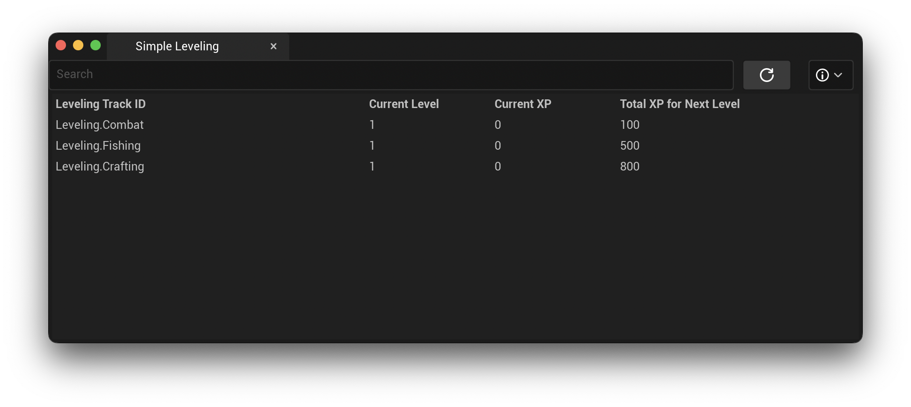

# Debugging

**SimpleLeveling** comes packaged with an Editor Utility for viewing leveling tracks while running your game in PIE.



Once leveling tracks are registered via the `SimpleLevelingSubsystem`, all leveling tracks defined in the Data Asset will be present within the Editor UI.

To open the editor, navigate to `Window -> Simple Leveling`.

## Editor Features

By default, the editor will display a Search Field, a Refresh Button, and a dropdown menu with a few options.


* **Search:** Search by leveling track ID, name, or description.
* **Refresh Button:** Attempts to find leveling tracks and display them in the editor. Leveling tracks are only available while your game is running in PIE. Otherwise the leveling track list will be blank.
* **Automatic Refresh:** Enabling **Automatic Refresh** in the editor will set a 1 second timer that automatically calls *Refresh*. While this should present no performance issues, be sure to disable this when you are not running your game in PIE. You may enable this to check in real time if your game is working as expected.
* **Display Leveling Track Name:** When enabled, the localized name field will be displayed in the leveling tracks list.
* **Display Leveling Track Description:** When enabled, the localized description field will be displayed in the leveling tracks list.
* **Verbose Logging:** When enabled, the `SimpleLevelingEditorLog` will send logs to the Output Log. Use this to debug the editor if leveling tracks are not displaying correctly.

## Debugging SimpleLeveling

### Logs

If **SimpleLeveling** is not tracking leveling tracks, the first step is to enable the logs in your project. To do this, you will need to open your project's `DefaultEngine.ini` file. At the end of the file, add the following lines:

```ini
[Core.Log]
SimpleLevelingLog=Verbose
SimpleLevelingEditorLog=Verbose
```

Enabling these will display the internal logs for **SimpleLeveling**. These can be used to trace the execution path to see where the problem is occurring.

### Issues & Support

If you diagnose a problem with **SimpleLeveling**, are unable to get it working properly, or have a new feature request, please add an issue to the [Github Issue Tracker](https://github.com/Ericdowney/SimpleLevelingExample/issues).