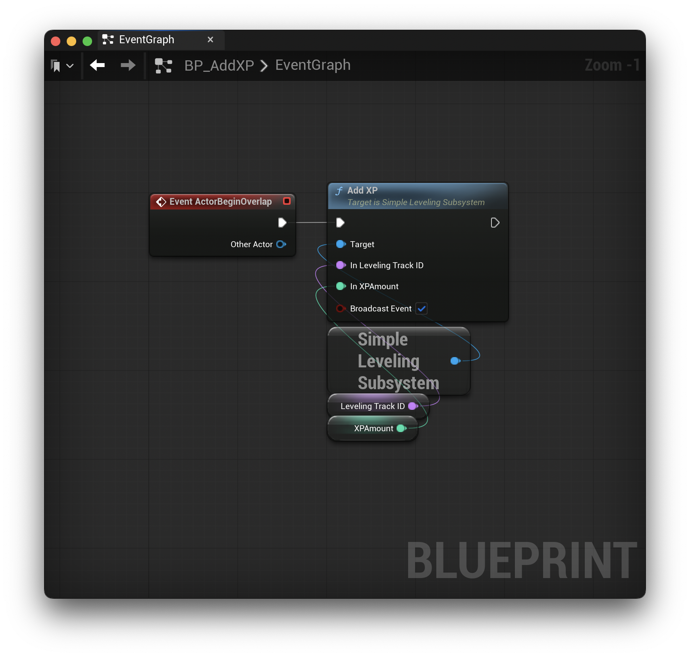

# Example Project

The provided example project shows a basic setup for **SimpleLeveling**. It defines 3 leveling tracks: `Leveling.Combat`, `Leveling.Fishing`, and `Leveling.Crafting` to show the various ways **SimpleLeveling** can be used. However, you can define your leveling tracks however you want specific to your game's needs.

## Subsystem Definition Asset

The `USimpleLevelingSubsystemDefinition` holds the configuration for all leveling tracks that will be tracked via the global `USimpleLevelingSubsystem`. The following shows the Data Asset from the example project.

This process is described in detail in the [Setup Documentation](./Setup.md)

## `BP_AddXP`

The example project has a Blueprint Actor defined that adds a configurable amount of XP to a leveling track. It has the following two *Instance Editable* parameters:

* `LevelingTrackID` (`FName`) - Defines which leveling track (per instance) to add XP.
* `XPAmount` (`Integer`) - Defines the amount of XP (per instance) to add.

This is applied to the `USimpleLevelingSubsystem` as follows:

Since the `USimpleLevelingSubsystem` is accessible anywhere a `UGameInstance` or `UWorld` object exists, you can interact with all leveling tracks almost anywhere.

In the example, I've placed three instances of the `BP_AddXP` actor, each tied to one of the configured leveling tracks.