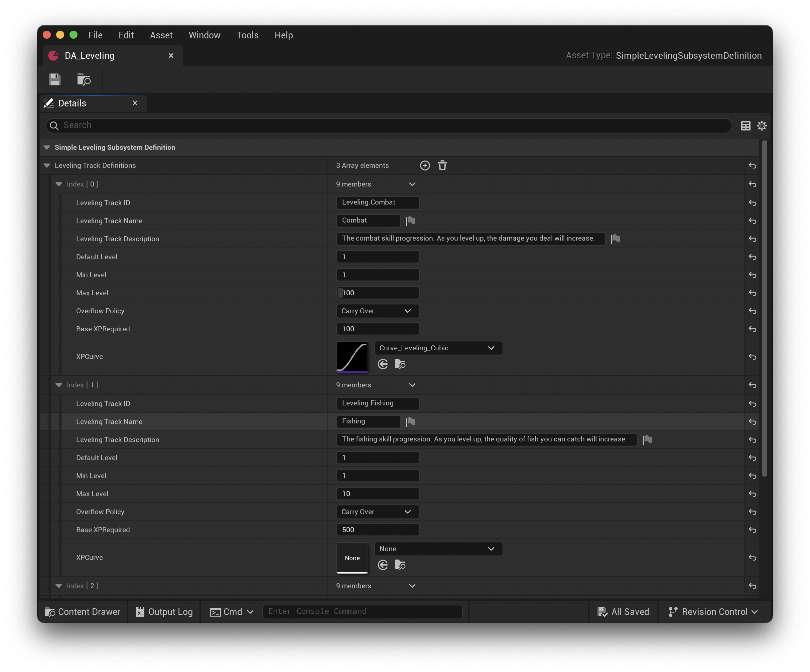

# Setup

*Please Note: All functionality is supported in both Blueprints & C++.*

Once the plugin is installed and enabled in Unreal Engine, if you want to use the plugin with C++, you will need to add `SimpleLeveling` to your project file, `<YourGame>.uproject`, under `Modules -> AdditionalDepenedencies` and the `Plugins` array. Here's the example's project file for reference:

```
{
    "FileVersion": 3,
    "EngineAssociation": "5.6",
    "Category": "",
    "Description": "",
    "Modules": [
        {
            "Name": "AttributesPluginExample",
            "Type": "Runtime",
            "LoadingPhase": "Default",
            "AdditionalDependencies": [
                "Engine",
                "AIModule",
                "UMG",
                "CoreUObject",
                "SimpleLeveling"
            ]
        }
    ],
    "Plugins": [
        {
            "Name": "ModelingToolsEditorMode",
            "Enabled": true,
            "TargetAllowList": [
                "Editor"
            ]
        },
        {
            "Name": "StateTree",
            "Enabled": true
        },
        {
            "Name": "GameplayStateTree",
            "Enabled": true
        },
		{
			"Name": "SimpleLeveling",
			"Enabled": true
		}
    ]
}
```

## Create Data Asset

The plugin provides a `USimpleLevelingSubsystemDefinition` class to create all of your inventories. In Unreal Engine, right click in the Content Browser and navigate to `Miscellaneous -> Data Asset`. Select `"Simple Leveling Subsystem Definition"` in the dialog.


With the Data Asset created, open it, and define your game's global leveling tracks. The following is the data asset from the example project. It defines three leveing tracks, `Leveling.Combat`, `Leveling.Fishing`, and `Leveling.Crafting`.



### Level Track Definition

The `USimpleLevelingSubsystemDefinition` can accept as many leveling tracks as your game requires. Each leveling track definition takes the following parameters:

* **Leveling Track ID** *(Required)* - The unique identifier for the leveling track. Used to access / modify it through the subsystem.
* **Leveling Track Name** *(Optional)* - The displayable name for the leveling track. Supports localization via Unreal Engine String Tables.
* **Leveling Track Description** *(Optional)* - The displayable description for the leveling track. Supports localization via Unreal Engine String Tables.
* **Default Level** *(Required)* - The level at which the leveling track will begin. Defaults to 1.
* **Min Level** *(Required)* - The minimum level the leveling track supports. Defaults to 1.
* **Max Level** *(Required)* - The maximum level the leveling track supports. Defaults to 100. Once reached, the level track will no longer allow XP to accumulate.
* **Overflow Policy** *(Required)* - Determines how XP is used when a leveling track reaches the next level. *Carry Over* is the default behavior and XP will be applied to towards the next level if it exceeds the current. *Discard* will not apply any extra XP to the next level.
* **Base XP Required** *(Required)* - This is the XP required required to achieve `MinLevel + 1`. It will be applied to all future levels based on the XP Curve or linearly when a curve is not supplied.
* **XP Curve** *(Optional)* - A Float Curve (`UCurveFloat*`) asset. The **X** value must always be between 0 & 1, while the **Y** value can be whatever works best for your game. The `CurrentLevel` is normalized across `MinLevel` and `MaxLevel` requiring the **X** value to be between 0 & 1.

*Please Note: Leveling tracks use `int32` to store all level and XP values. This limits all XP and level calculations to a range of 0 - 2,147,483,647. Blueprints do not support unsigned integers, so every value is signed.*

### XP Scaling

The XP required to reach the next level for any given leveling track uses one of the following two formulas.

#### XP Formula (Curve)

```c++
BaseXPRequired + (BaseXPRequired * CurveModifier)
```

This formula uses the `XPCurve` to calculate a modifier based on the normalized `CurrentLevel`. `BaseXPRequired` is used as the foundation to apply all curve values.

Given an S-Curve with values *(0, 0) - (0, 4000)*, and a leveling range of *1 - 100*, you can expect values similar to:

* 1 to 2 - 100 (`BaseXPRequired`)
* 2 to 3 - 221 XP
* 3 to 4 - 583 XP
* 4 to 5 - 1179 XP


#### XP Formula (Linear, *No Curve*)

```c++
return BaseXPRequired + (BaseXPRequired * (CurrentLevel - 1))
```

This formula uses linear scaling based on the `CurrentLevel`.

Given `BaseXPRequired` is 100, you can expect values similar to:
s
* 1 to 2 - 100 (`BaseXPRequired`)
* 2 to 3 - 200
* 3 to 4 - 300
* 4 to 5 - 400

## Register Subsystem Definition

Once all leveling track definitions are defined, you must register the `USimpleLevelingSubsystemDefinition` Data Asset with the subsystem.


Once registered, you can view all registered leveling tracks in the *Simple Leveling* editor.


## Change Events

SimpleLeveling provides event-driven hooks so your game can react to level ups, XP gains, and resets without manual polling. 

Whether you are using the `USimpleLevelingSubsystem`, `USimpleLevelingTrackComponent`, or `USimpleLevelingTrack`, events are published whenever a leveling track updates. The published event will have a single parameter, the `USimpleLevelingTrackChange`. The change object holds the following four values:

* `FName LevelingTrackID` - The identifier for the leveling track that changed.
* `ESimpleLevelingTrackChangeType Type` - The type of change that occurred.
* `int32 LevelChange` - The change in level. 0 if not applicable.
* `int32 XPChange` - The change in XP. 0 if not applicable.

Use this event and data to update other systems or the UI.

## SimpleLeveling API

All three objects:

* `USimpleLevelingSubsystem`
* `USimpleLevelingTrackComponent`
* `USimpleLevelingTrack`

Have an identical API for managing level tracks, adding XP, and getting / setting the current level. If you are using the subsystem, you must supply the `LevelingTrackID` for every call.

For more information see the [API Reference Documentation](./APIReference.md)