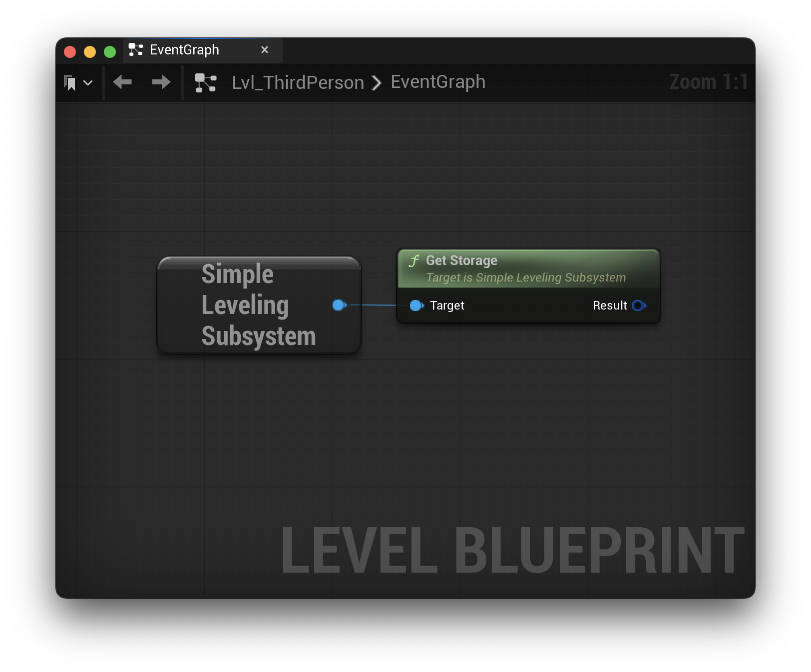
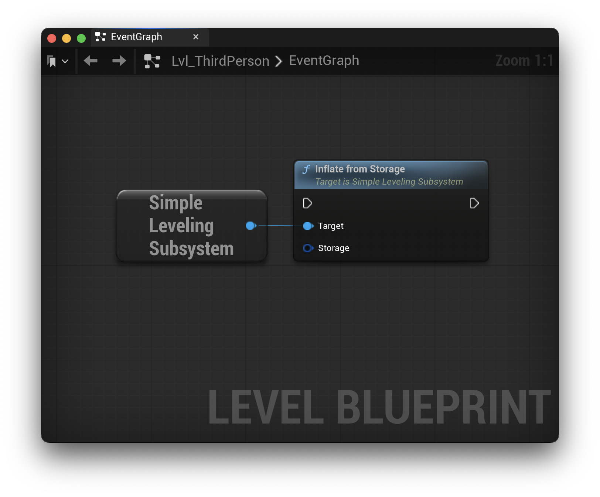
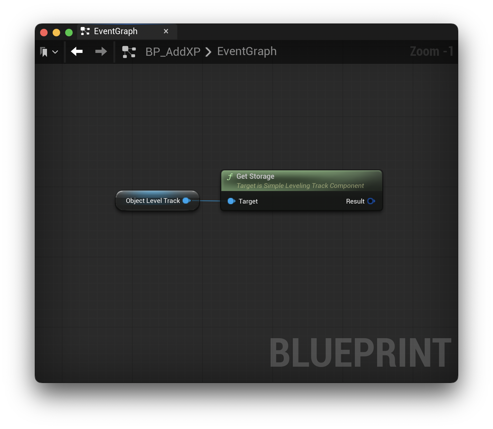
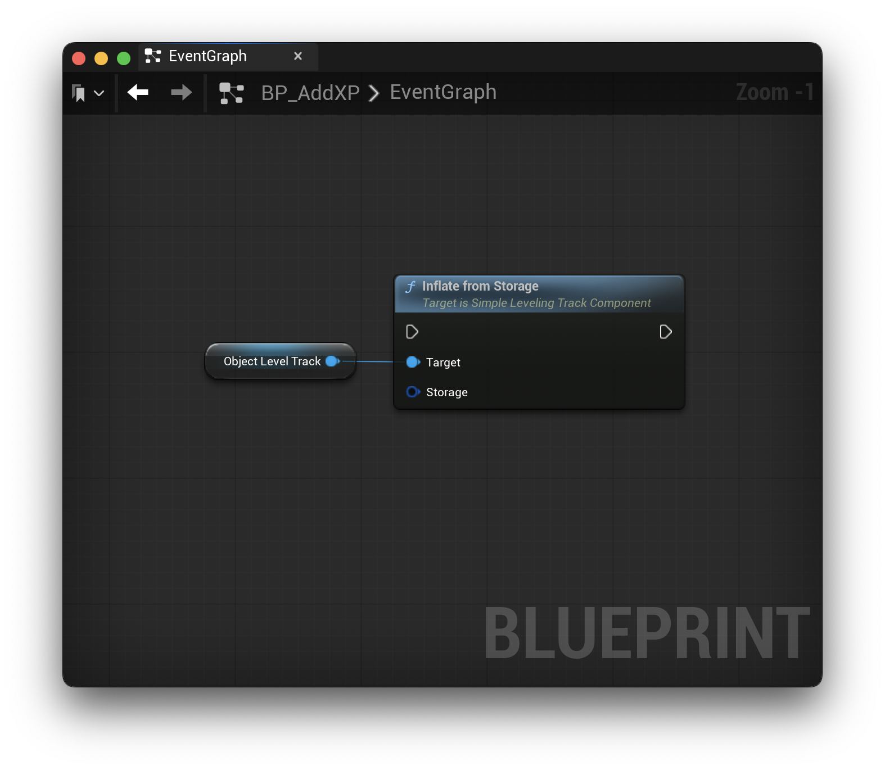

# Storage

**SimpleLeveling** provides a structure meant to be used in conjunction with Unreal's `USaveGame` class, as well as a simple API to save and load leveling track data in the subsystem. This allows you to save levelign track data however and whenever you like.

*All functionality is supported by both Blueprints and C++.*

## FSimpleLevelingSubsystemStorage

The `FSimpleLevelingSubsystemStorage` struct stores the list of registered leveling tracks with their values.

To use this in your project, simply add this to your `USaveGame` subclass:

```c++
UPROPERTY(/* Property Config */)
FSimpleLevelingSubsystemStorage LevelingTracks;
```

### Saving Subsystem Data

The `USimpleLevelingSubsystem` provide two APIs for storage. The first is to retrieve the current state as storage:

**C++**

```c++
FSimpleLevelingSubsystemStorage GetStorage()
```

**Blueprints**



This function collects all registered leveling tracks, converts them to storage, and returns the result.

The second API is used to restore leveling track data to the subsystem.

**C++**

```c++
void InflateFromStorage(const FSimpleLevelingSubsystemStorage Storage)
```

**Blueprints**



You can pass the same data structure back to the `InflateFromStorage` function to restore all previously saved leveling tracks.

### Saving Component Data

The `USimpleLevelingTrackComponent` provides two APIs, similar to the subsystem, for storage. The first API retrives the current component state as storage:

**C++**

```c++
FSimpleLevelingTrackStorage GetStorage() const
```

**Blueprints**



Since the `USimpleLevelingTrackComponent` is only responsible for a single leveling track, the storage data is for a single leveling track. Depending on your game's needs, you can create your own data structure to store these single leveling track data structures.

The second API is to restore the leveling track data to the component.

**C++**

```c++
void InflateFromStorage(FSimpleLevelingTrackStorage Storage)
```

**Blueprints**



**Please note:**, the `InflateFromStorage` functions overwrite any existing data. If you already have leveling tracks registered, they will be removed.